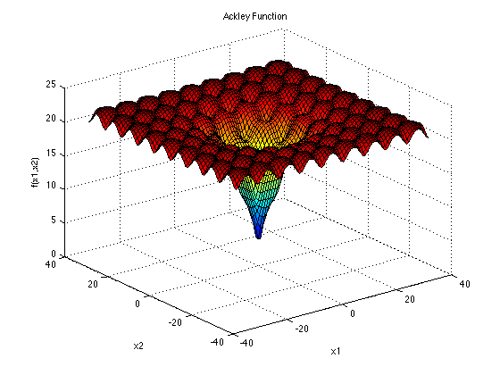

# Intelligent Systems Project Documentation

## Introduction

Intelligent Systems are computer programs that exhibit characteristics and behaviors comparable to human or animal intelligence. This definition serves as a guiding principle for this project. Among the most prominent and widely used algorithms in the field of intelligent systems or artificial intelligence are genetic algorithms. These algorithms evolve a population of individuals through random actions similar to those observed in biological evolution (genetic mutations and recombinations), as well as through selection based on some criteria that determines which individuals are more adapted and survive, and which are less fit and discarded.

## Problem Description

The problem to be solved in this project is the optimization of functions known as artificial landscapes, which are useful for evaluating the performance of genetic algorithms.

## Objective

The objective of this project is to test various features of genetic algorithms in order to determine how different methods of crossover, mutation, selection, replacement, etc. affect different problems and identify which parameters are best suited for each situation. The goal is to locate the minimum of each of the proposed functions using genetic algorithms.

### Functions to Optimize

1. Rastrigin Function:

The Rastrigin function is defined as follows:

f(x1, x2, ..., xn) = An + sum((xi^2 - Acos(2pixi)), i=1 to n)

where A = 10 and n = 3. The variables xi are bounded by -5.12 and 5.12, and the global minimum occurs at (x1, x2, ..., xn) = (0, 0, ..., 0) with a function value of 0.

2. Ackley Function:

The Ackley function is defined as follows:

f(x, y) = -20exp(-0.2sqrt(0.5*(x^2 + y^2))) - exp(0.5*(cos(2pix) + cos(2piy))) + e + 20

The variables x and y are bounded by -5 and 5, and the global minimum occurs at (x, y) = (0, 0) with a function value of 0.

3. Beale Function:

The Beale function is defined as follows:

f(x, y) = (1.5 - x + xy^2)^2 + (2.25 - x + xy^2)^2 + (2.625 - x + x*y^3)^2

The variables x and y are bounded by -4.5 and 4.5, and the global minimum occurs at (x, y) = (3, 0.5) with a function value of 0.

4. Bukin Function:

The Bukin function is defined as follows:

f(x, y) = 100sqrt(abs(y - 0.01x^2)) + 0.01*abs(x + 10)

The variables x and y are bounded by -15 and -5, and -3 and 3 respectively. The global minimum occurs at (x, y) = (-10, 1) with a function value of 0.

## Algorithm Parameters

In order to perform a detailed study of the importance of the parameters in a genetic algorithm, the program should allow the user to input the following parameters:

- Population size
- Number of generations
- Crossover probability
- Mutation probability
- Elitism (indicates the number of elite individuals, 0 for no elitism)

### Replacement Strategy

- 0 -> Stationary.
- 1 -> Generational.

### Crossover Operator

Three crossover operators are available:

- 0 -> Single-Point Crossover.
- 1 -> Multi-Point Crossover.
- 2 -> Uniform Crossover.

### Mutation Operator

Three mutation operators are available:

- 0 -> Uniform Distribution: Mutation is performed by adding a value from a uniform distribution, such as [-1, +1], to the gene value at position i.
- 1 -> Normal Distribution: Mutation is performed by adding a value from a normal distribution centered at 0 with a specified standard deviation to the gene value at position i. A higher standard deviation increases the probability of introducing larger changes.
- 2 -> Random: Mutation is performed by replacing the gene value at position i with a new randomly generated value within the allowed range for that variable. This strategy often leads to larger variations than the other two.

### Individual Selection Algorithm

Four selection algorithms are available:

- 0 -> Roulette Wheel Selection: The probability of selecting an individual is proportional to its relative fitness, which is the ratio of its fitness to the sum of fitness values of all individuals in the population. This method may result in repeated selection of individuals with significantly higher fitness, leading to less variation in the next generation.
- 1 -> Rank Selection: The probability of selection is inversely proportional to the individual's rank when all individuals are sorted in descending order of fitness. This method is less biased than roulette wheel selection when there is a large difference between the highest fitness values and the rest.
- 2 -> Tournament Selection: Two pairs of individuals are randomly selected from the population with equal probability. The individual with higher fitness is selected from each pair. Finally, the two finalists are compared, and the one with the highest fitness is selected. This method tends to generate a more balanced distribution of selection probabilities compared to the previous two.
- 3 -> Truncated Selection: Random selection is performed after discarding the n individuals with the lowest fitness in the population.

## Usage

To use the program, simply input the desired parameter values, including population size, number of generations, crossover probability, mutation probability, and elitism (the number of elitist individuals, 0 for no elitism). Additionally, select the optimization function, replacement strategy, crossover operator, mutation operator, and individual selection algorithm.

The program will generate a CSV file with the evolution of the best individual and the population, which can be further analyzed using a data visualization tool. Alternatively, it can display the evolution graphically on the screen.

## Conclusion

This project aims to explore the capabilities and behavior of genetic algorithms in solving optimization problems. By implementing a Java program with a user-friendly interface, users can experiment with different algorithm parameters and observe how they affect the optimization process for different functions. The results obtained from this project will contribute to a better understanding of genetic algorithms and their applicability in various domains.
